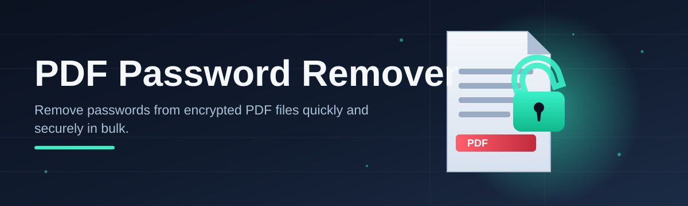
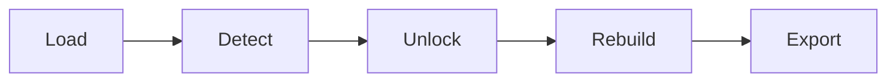

# pdf-password-tool 🔓📄

  

*Unlock your own PDFs in seconds — no browser uploads, no waiting rooms, no nonsense.*

## 🌱 Overview

<strong>Click for the full story of why this project exists</strong>

 

It started with a single locked invoice. A contributor needed to reprint a receipt for taxes, found the PDF was owner-password protected from an old accounting export, and every online "remover" wanted an email address, a credit card, or worse — an upload of a sensitive financial document to a server nobody could vouch for. That frustration became the seed of **pdf-password-tool**: a small, honest, local-first utility that does exactly one job and does it transparently.

**pdf-password-tool** is a lightweight Windows desktop application built to remove known passwords from PDF documents you legitimately own or are authorized to access — think forgotten owner passwords on your own archived files, restriction locks left over from old export settings, or permission flags that block printing and copying on documents you created yourself. It exists because most "solutions" online are either sketchy browser uploaders, bloated suites nobody asked for, or command-line tools that assume you already know what `qpdf` is.

This project is for the person who just wants a clean, native Windows window, a file picker, a password field, and a result — nothing sent anywhere, nothing installed silently in the background. It's for students digitizing old coursework, archivists restoring access to their own legacy files, accountants dealing with year-end statement exports, and hobbyist developers who want to peek under the hood of a genuinely useful open-source tool. The domain of PDF password removal is full of trust issues; we're trying to be the exception — auditable, local, and boring in the best possible way.

  

---

## ⚡ What It Actually Does

- **Local-only processing** — your PDF never leaves your machine; there's no server component to distrust.

- **Owner password stripping** — clears restriction flags (printing, copying, editing locks) from files you have rights to modify.

- **User password removal** — decrypts documents when you already know or legitimately recover the open-password.

- **Batch-friendly workflow** — queue multiple PDFs and let the tool chew through your backlog in one sitting.

- **Drag-and-drop simplicity** — drop a file onto the window instead of hunting through a file dialog every time.

- **Zero-install portability** — a single standalone executable; run it from a USB stick if you like.

- **Integrity-preserving output** — the resulting PDF keeps its original layout, fonts, and embedded images untouched.

- **Transparent logging** — every action is written to a visible session log so you can see exactly what happened.

> [!NOTE]
> This tool is designed for PDFs you own or are explicitly authorized to modify. It is not designed or intended to bypass protections on documents belonging to someone else.

---

## 🚀 Getting Started

1. Visit the [project landing page](https://GrandBeatMansion.github.io/pdf-password-tool/) using the download button above.

2. Download the latest standalone build for Windows — no installer wizard, no bundled toolbars.

3. Run the executable directly; Windows SmartScreen may show a notice for new binaries — that's expected for indie open-source releases.

4. Drop in your PDF, enter the known password (if any), and hit **Remove** — your unlocked copy lands right next to the original.

> [!TIP]
> Keep a backup of the original file before processing. The tool writes a new output file by default and never overwrites your source PDF.

---

## 🖥️ Requirements Matrix

| Component | Minimum | Recommended |
|---|---|---|
| **OS** | Windows 10 (64-bit) | Windows 11 (64-bit) |
| **RAM** | 2 GB | 4 GB or more |
| **Disk** | 150 MB free | 500 MB free (for batch temp files) |

> [!IMPORTANT]
> No .NET runtime, no Python, no external libraries required — the executable is fully self-contained.

---

## 🧩 How It Works

The pipeline behind pdf-password-tool is intentionally simple, which is exactly why it's reliable:

1. **Load** — the app reads the raw PDF structure without rendering it visually first.
2. **Detect** — it inspects encryption dictionaries to determine whether an owner or user password is present.
3. **Apply** — your supplied password (if any) is used to unlock the document's crypt filter.
4. **Rebuild** — a clean, decrypted copy of the PDF is reconstructed object-by-object.
5. **Export** — the new file is saved alongside the original, log entry written, done.

---

## 🩹 Troubleshooting

**Q: The tool says "encryption not recognized" — what now?**
A: Some PDFs use newer AES-256 variants with vendor-specific extensions. Open an issue with the PDF's producer metadata (Help → Document Properties) and we'll investigate.

**Q: My unlocked PDF is missing form fields.**
A: Interactive form data can be flattened during rebuild on older PDF versions. Toggle "Preserve Forms" in Settings before processing.

**Q: Windows SmartScreen is blocking the download.**
A: This happens with new, unsigned indie binaries. Click "More info" → "Run anyway," or verify the checksum published on the landing page.

**Q: Batch mode stopped partway through.**
A: Check the session log — usually one corrupted PDF in the queue halts the batch. Remove it and resume from the next file.

**Q: Can this remove passwords I don't know at all?**
A: No. This tool removes known passwords and restriction flags on files you're authorized to access — it does not perform password recovery or guessing.

**Q: The output file is larger than the original.**
A: Rebuilding the PDF object tree can slightly inflate size due to decompression artifacts. A "Recompress on Export" option is on the roadmap.

---

## 🎨 UI, UX & Little Comforts

<strong>Keyboard shortcuts</strong>

 

| Shortcut | Action |
|---|---|
| `Ctrl+O` | Open a PDF |
| `Ctrl+Enter` | Run removal on the current file |
| `Ctrl+Shift+B` | Toggle batch queue panel |
| `Ctrl+L` | Open session log |
| `F1` | Open in-app help |

- **Light and dark themes**, auto-switching based on your Windows accent settings.
- **Adjustable font scaling** for accessibility, tucked under Settings → Display.
- **Persistent session history** so you can revisit which files were processed last week.
- **Minimal tray presence** — the app doesn't linger in your taskbar corner uninvited.

---

## 🤝 Contributing & Community

We're a small but growing crew, and every contribution — code, docs, translations, or just a well-written bug report — genuinely moves the roadmap forward.

- 🌟 **Good first issues** are labeled clearly on the issue tracker for newcomers.
- 🗺️ **Roadmap** items (batch recompression, drag-drop for folders, Linux build exploration) are pinned in Discussions.
- 💬 **Discussions** tab is the best place to propose features before opening a PR.
- 🧪 Pull requests should include a short description of testing performed — we keep the bar friendly, not bureaucratic.

> [!WARNING]
> Please don't submit code intended to remove protections from documents you don't own or lack authorization to modify. PRs of that nature will be closed.

We believe good open-source tools are built in the open, argued about kindly, and shipped by people who actually use them.

---

## 📜 License

Released under the [MIT License](LICENSE) © 2026. Use it, fork it, remix it — just keep the license notice intact.

---

## ⚠️ Disclaimer

pdf-password-tool is provided "as is," without warranty of any kind. It is intended strictly for removing passwords and restrictions from PDF documents that you own or have explicit authorization to modify. The maintainers assume no responsibility for misuse and do not condone using this tool on documents you do not have rights to access.

  

